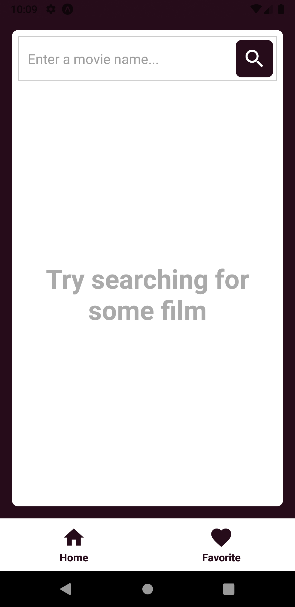
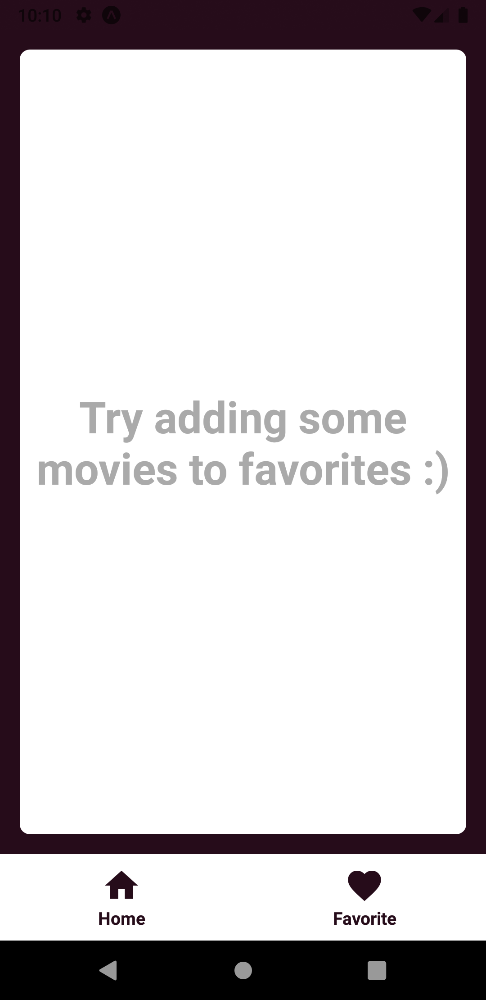
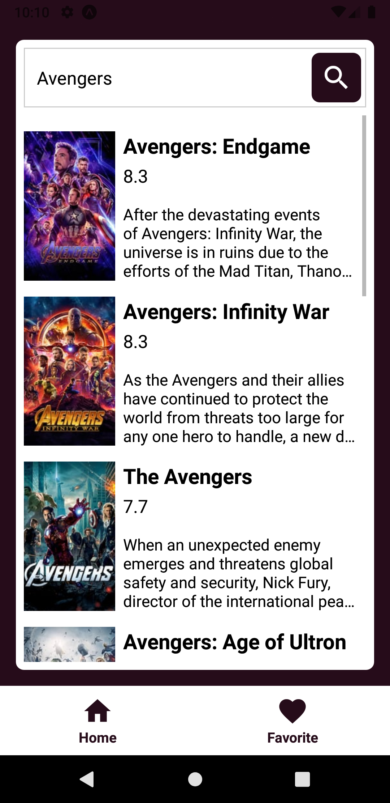
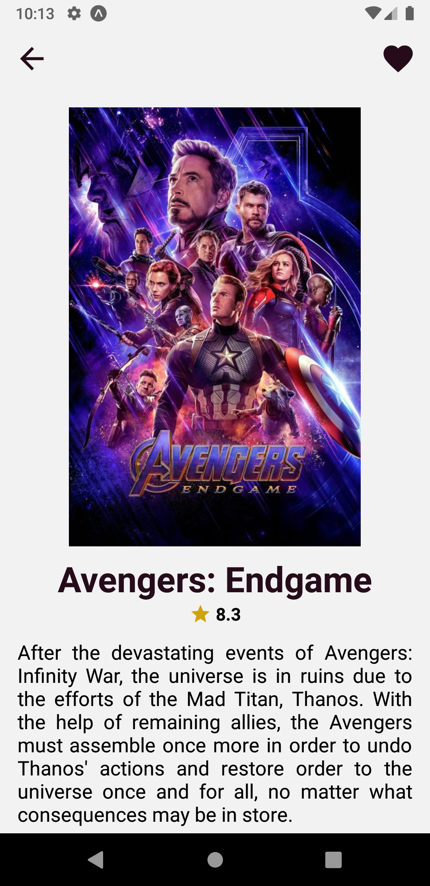
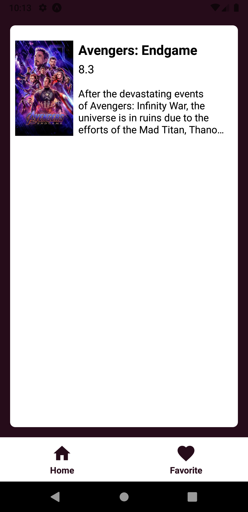

## Movie Finder :movie_camera: :mag:
Movie finder is an application made for movie fans that gives you access to a database of movies to discover new ones and save your favorites. This app was made for the [frontend_challenge](https://github.com/helpetapp/front-end-challenge) which is a challenge that proposes an app in react native and uses this [API](https://tmdb.apps.quintero.io/) that wraps [The Movie Database API](https://www.themoviedb.org/documentation/api) with GraphQL.

## Preview

  

## Screenshots

  
  
  
  
  

## Technologies used
- [Expo](https://expo.io/)
- [GraphQL Request](https://github.com/prisma-labs/graphql-request)
- [Yarn](https://yarnpkg.com/)
- [Eslint](https://eslint.org/)
- [Prettier](https://prettier.io/)
- [AsyncStorage](https://github.com/react-native-async-storage/async-storage)
- [React Navigation](https://reactnavigation.org/)
- [EditorConfig](https://editorconfig.org/)

## Contributors

- <a href="https://github.com/antoniolopesg"><strong>Antonio Lopes</strong></a>
